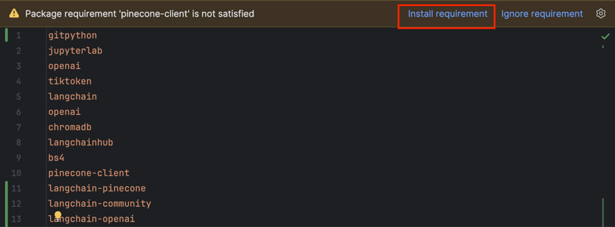
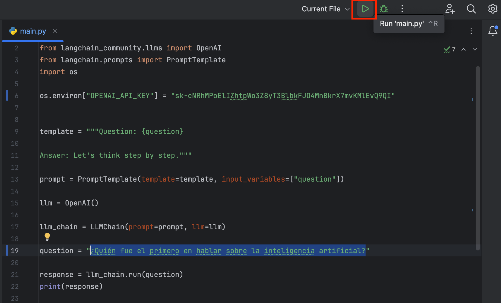
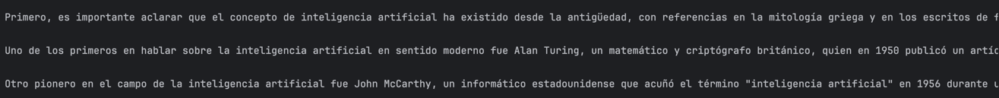
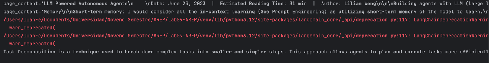
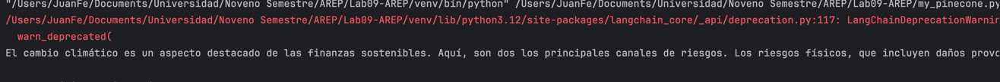
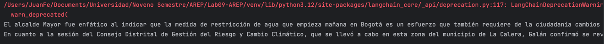
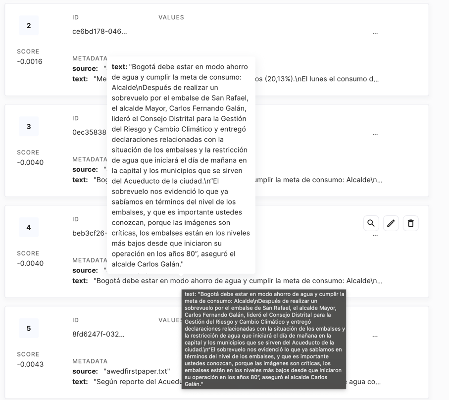
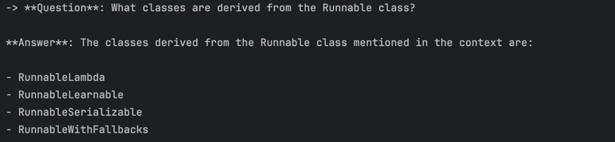
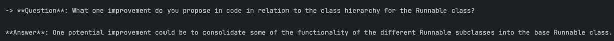

# Langchain, pinecone y OpenAI
A continuación, se desarrollaran cuatro retos relacionados con el uso de la inteligencia artificial (llm) usando Python, y se tendrá una breve aproximación con el proporcinamiento de una fuente de conocimiento usando una base de datos de vectores.

## Autor
* **Juan Felipe Sánchez Pérez**

## Instalación y ejecución
### Prerequisitos

* Versión de Python usada: 3.12.3.
* Una vez clone el repositorio y lo abrá en el IDE (se recomienda PyCharm), asegurese de que se crea el directorio venv.

### Instalación y uso

1. Clone el repositorio utilizando el siguiente comando:
   ```
      git clone https://github.com/juansanxz/Lab09-AREP.git
   ```

2. Diríjase a su IDE (se recomienda PyCharm), abra el proyecto e instale los requerimientos indicados por el archivo _requirements.txt_:

     
3. Agregue la siguiente línea a los cuatro archivos con la extensión .py, despues de realizar las importaciones, e indique su llave para acceder a los servicios expuestos por la API de OpenAI:

    ```
         os.environ["OPENAI_API_KEY"] = {su llave}
    ```

4. Una vez realizado esto, podrá ejecutar cualquiera de los cuatro archivos con extensión .py que encontrará en el directorio raíz.  
Por ejemplo, para ejecutar el archivo _main.py_, presione el botón indicado a continuación:  

   

## Retos
### 1. Usando python, escribir un programa para enviar prompts a ChatGPT y recibir respuestas

Se crea el archivo _main.py_, que contendrá la implementación necesaria para realizar la creación y envío del prompt a ChatGPT, usando una llave para acceder a la API ofrecida por OpenAI. Al realizar la siguiente pregunta: "¿Quién fue el primero en hablar sobre la inteligencia artificial?", y hacer el llamado, la respuesta obtenida fue la siguiente:  
  
Mencionando que:  
_"Uno de los primeros en hablar sobre la inteligencia artificial en sentido moderno fue Alan Turing, un matemático y criptógrafo británico, quien en 1950 publicó un artículo titulado "Computing Machinery and Intelligence" (Máquinas de computación e inteligencia), en el que planteó la cuestión de si las máquinas pueden pensar y propuso su famoso "Test de Turing" para evaluar la inteligencia de una máquina."_    

### 2. Usando una base de datos de vectores, construya un RAG (Generación mejorada por recuperación)  

En el archivo _llmmemorydb.py_, se encuentra resuelto este desafío. Para solucionarlo, se le proporcionó al llm información adicional para atender el prompt enviado. Esto es bastante útil para que la inteligencia artificial pueda usar información extra o privada, y de esta forma analizar y responder un prompt específico, implementando un _Retriever_.  
La información que se cargó, provenía de la URL `https://lilianweng.github.io/posts/2023-06-23-agent/`, y la pregunta realizada fue: _"What is Task Decomposition?"_.  
La respuesta fue la siguiente:  
_"Task Decomposition is a technique used to break down complex tasks into smaller and simpler steps. This approach allows agents to plan and execute tasks more efficiently by dividing them into manageable components. Task decomposition can be achieved through various methods such as prompting with specific instructions or utilizing human inputs."_  
  

### 3. Usando Pinecone, implemente un RAG

Este reto se encuentra resuelto en el archivo _my_pinecone.py_. Para solucionarlo, se creó una cuenta en _Pinecone_, se generó una llave para interactuar con un este servicio, y se creó un índice (index), el cual será utilizado por la inteligencia artificial para responder el prompt proporcionado. Tal índice fue construido con la información contenida por el archivo _awedfirstpaper.txt_, en el que se mencionaban dos temáticas: _El calentamiento global_ y _El desabastecimiento de agua en Bogotá_.  
Se hicieron dos preguntas relacionadas con estas temáticas para observar si la respuesta referenciaba la información suministrada:

* _¿Qué provoca al calentamiento global?_  
     

* _¿Qué dijo el alcalde de Bogotá?_  
    

En pinecone se comprueba la creación del índice:  
  
Con la información suministrada:  
  

### 4. Implemente un RAG para responder a preguntas relacionada con código

El archivo _ragforcode.py_ contiene la implementación del reto. En este, la base de conocimientos suministrada correspondía a la contenida en el repositorio `https://github.com/langchain-ai/langchain`, especificamente en el path `/libs/core/langchain_core`.  
Posteriormente, se procedía con la división y almacenamiento de la información de soporte, para que el llm tuviera fuentes de conocimiento específicas y de esta manera tuviera la capacidad de atender de forma satisfactoria el prompt generado.  
Las preguntas realizadas con sus respectivas respuestas fueron:  
_"What classes are derived from the Runnable class?"_ 
  


_"What one improvement do you propose in code in relation to the class hierarchy for the Runnable class?"_
  

## Versión
1.0